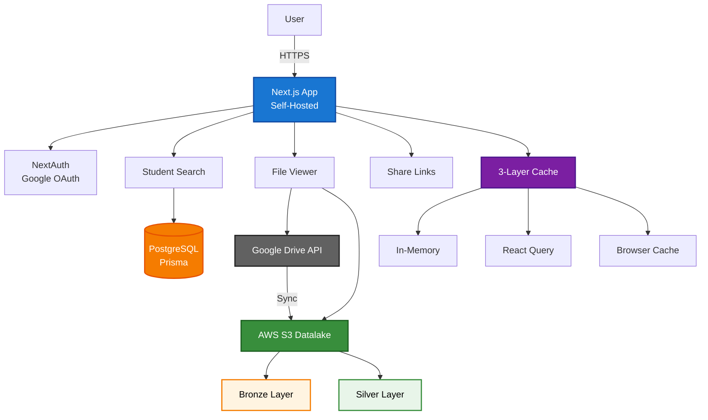
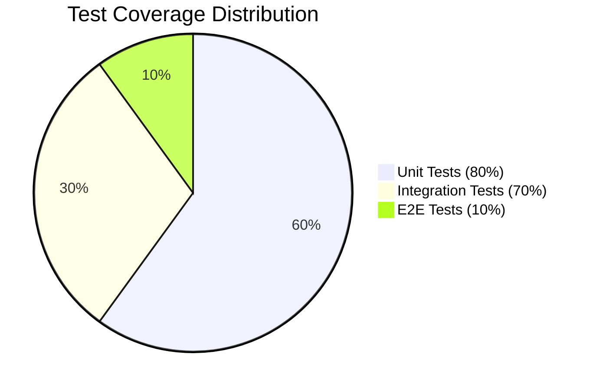
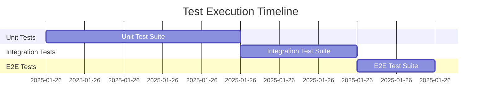
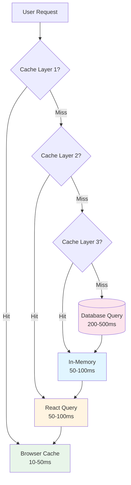
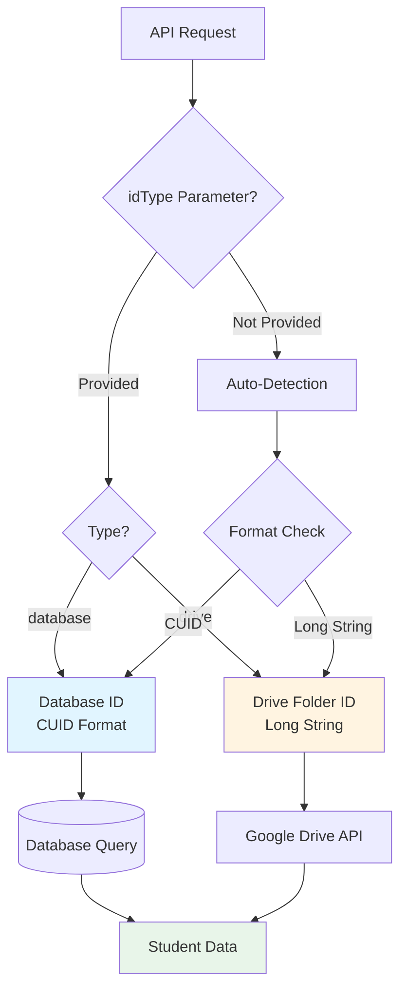
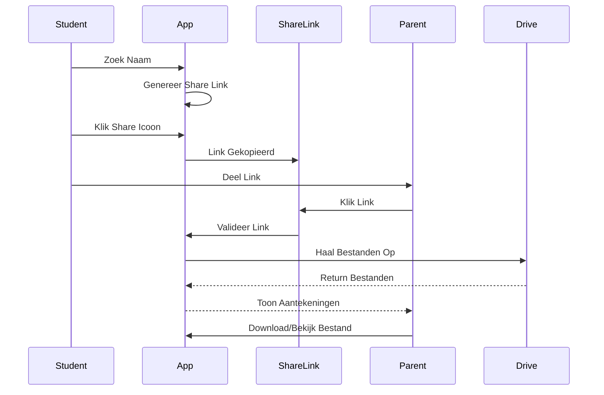

# Aantekeningen App

[](https://github.com/stephenadei/aantekeningen-app/actions/workflows/test.yml)

Een standalone Next.js applicatie voor het beheren van student aantekeningen voor Stephen's Privelessen.

## Architecture



## 🚀 Features

- **Student Zoeken**: Zoek studenten op naam
- **Aantekeningen Bekijken**: Bekijk alle aantekeningen van een student
- **Sharing Functionaliteit**: Genereer shareable links voor individuele studenten
- **Google Drive Integratie**: Directe toegang tot Google Drive bestanden
- **Datalake Storage**: AWS S3-based datalake voor schaalbare opslag
- **AI Metadata**: Automatische extractie van document metadata
- **Datum Extractie**: Intelligente datum extractie uit bestandsnamen en PDF metadata
- **Slimme Sortering**: Sorteer op datum uit titel, PDF creation date, of import datum
- **List & Grid Views**: Flexibele weergave met klikbare bestandsbalken
- **Dark Mode**: Volledige dark mode ondersteuning
- **Taxonomy Management**: Beheer van vakken, onderwerpen en topics
- **Responsive Design**: Werkt op desktop en mobiel

## 🔗 Live Demo

- **Hoofdsite**: [stephensprive.app](https://stephensprive.app)

## 🛠️ Tech Stack

- **Framework**: Next.js 16
- **Language**: TypeScript
- **Runtime**: Node.js 20.x LTS
- **Styling**: Tailwind CSS
- **Database**: PostgreSQL (Prisma)
- **Authentication**: NextAuth + Google OAuth2
- **Storage**: Google Drive API + AWS S3 Datalake
- **Caching**: In-memory + React Query
- **AI**: OpenAI API (optioneel)
- **Testing**: Vitest + Playwright + c8
- **Deployment**: Self-Hosted (Docker)

## 📁 Project Structuur

```
src/
├── app/
│   ├── api/
│   │   ├── students/
│   │   │   ├── [id]/
│   │   │   │   ├── files/route.ts
│   │   │   │   ├── overview/route.ts
│   │   │   │   └── share/route.ts
│   │   │   └── search/route.ts
│   │   └── metadata/
│   │       ├── preload/route.ts
│   │       └── status/route.ts
│   ├── student/[id]/page.tsx
│   └── page.tsx
├── lib/
│   └── google-drive-simple.ts
└── tests/
    ├── unit/           # Unit tests (60%)
    ├── integration/    # Integration tests (30%)
    ├── e2e/           # E2E tests (10%)
    ├── security/      # Security tests
    └── performance/   # Performance tests
```

## 🔧 Setup

### Prerequisites

- **Node.js 20.x LTS** of hoger
- **npm 10.x** of hoger

Gebruik `nvm` om de juiste Node.js versie te installeren:
```bash
nvm install 20
nvm use 20
```

### Installation

1. **Clone de repository**:
   ```bash
   git clone https://github.com/stephenadei/aantekeningen-app.git
   cd aantekeningen-app
   ```

2. **Installeer dependencies**:
   ```bash
   npm install
   ```

3. **Configureer environment variables**:
   
   Kopieer `.env.local.template` naar `.env.local` en vul de waarden in:
   ```bash
   cp .env.local.template .env.local
   ```
   
   Zie [AUTHENTICATION.md](AUTHENTICATION.md) voor gedetailleerde instructies over het verkrijgen van alle credentials.

5. **Test je setup**:
   ```bash
   # Check alle credentials
   node scripts/check-credentials.mjs
   
   # Test specifieke student ID
   node scripts/validate-student-id.mjs <student-id>
   ```

7. **Start development server**:
   ```bash
   npm run dev
   ```

## 🧪 Testing

De app heeft een uitgebreide test suite met unit, integration, E2E, security en performance tests:

### Test Commands
```bash
# Run all tests
npm run test:ci

# Individual test types
npm run test:unit          # Unit tests
npm run test:integration   # Integration tests
npm run test:e2e          # E2E tests
npm run test:security     # Security tests
npm run test:performance  # Performance tests
npm run test:smoke        # Smoke tests

# Development
npm run test:watch        # Watch mode
npm run test:ui           # Interactive UI
npm run test:coverage     # Coverage report
npm run test:summary      # Test summary
```

### E2E Test Setup
Voor E2E tests met Playwright, installeer eerst de browsers:
```bash
npx playwright install
```

### Test Coverage





- **Unit tests**: 80%+ coverage target
- **Integration tests**: 70%+ coverage target
- **Overall**: 75%+ coverage target

### CI/CD
Tests run automatically on every push and pull request via GitHub Actions. See [TESTING.md](TESTING.md) for detailed documentation.

## 🚀 Performance Optimalisatie



De app gebruikt een geavanceerde 3-layer caching strategie voor optimale prestaties:

### Cache Layers
1. **In-memory Cache** - Server-side cache voor snelle toegang
2. **React Query** - Client-side cache met automatic refetching (minuten)
3. **Browser Cache** - Local storage en HTTP cache (seconden)

### Performance Targets
- **First Load**: ~200-500ms (Database query)
- **Cache Hit**: ~50-100ms (In-memory + indexes)
- **Subsequent Loads**: ~10-50ms (browser cache)
- **Google Drive API calls**: Alleen bij sync (6u interval)

### Cache Management
- **Admin Dashboard**: `/admin/cache` voor monitoring
- **Background Sync**: Automatische sync elke 6 uur
- **Manual Sync**: Via admin dashboard of API

### Student Management
- **Database**: Studenten worden opgeslagen in PostgreSQL via Prisma
- **Search**: Directe database queries voor snelle zoekresultaten

## 🆔 Student ID Types



The app supports two types of student identifiers:

### Database Student IDs
- **Format**: CUID strings (e.g., `cmjso19kg0000kp5lkb8uc4bi`)
- **Source**: Auto-generated by Prisma when students are created
- **Usage**: Primary identifier for students in the database
- **API**: `/api/students/{id}?idType=database`

### Google Drive Folder IDs  
- **Format**: Longer strings (e.g., `1zzYz5TURBj0ieMC7-xvFAzA5gkqoQpPw`)
- **Source**: Google Drive folder IDs where student files are stored
- **Usage**: Direct access to Drive folders without database lookup
- **API**: `/api/students/{id}?idType=drive`

### Auto-Detection
If no `idType` parameter is provided, the API automatically detects the ID type based on format:
- CUID format → Database ID
- Longer strings → Drive folder ID

### Validation Tools
```bash
# Check what type an ID is
node scripts/validate-student-id.mjs <student-id>

# Check all credentials
node scripts/check-credentials.mjs
```

## 📚 API Endpoints

### Student Endpoints
- `GET /api/students/search?q={name}` - Zoek studenten op naam
- `GET /api/students/{id}/files` - Haal bestanden van student op
- `GET /api/students/{id}/overview` - Haal overzicht van student op
- `GET /api/students/{id}/share` - Genereer shareable link

### Metadata Endpoints
- `GET /api/metadata/preload` - Preload alle metadata
- `GET /api/metadata/status` - Controleer cache status

## 🔐 Authentication

De app gebruikt NextAuth met Google OAuth2 voor admin toegang en custom PIN verificatie voor studenten. Zorg ervoor dat:

1. PostgreSQL database is geconfigureerd
2. Google OAuth2 credentials zijn geconfigureerd
3. Google Drive API is geactiveerd
4. OAuth2 refresh token is gegenereerd
5. NextAuth secret is geconfigureerd

## 🚀 Deployment

De app is geconfigureerd voor self-hosted deployment met Docker:

1. **Docker deployment** - Zie `DEPLOYMENT.md` voor details
2. **Environment variables** via `.env.local` bestand
3. **Custom domain** via NGINX reverse proxy

## 📱 Sharing Functionaliteit



### Voor Studenten:
1. Zoek je naam in de app
2. Klik op het share icoon (📤)
3. Link wordt gekopieerd naar klembord
4. Deel met ouders/leraren

### Voor Ouders/Leraren:
1. Klik op de gedeelde link
2. Directe toegang tot alle aantekeningen
3. Download/bekijk bestanden individueel

## 🤝 Contributing

1. Fork de repository
2. Maak een feature branch
3. Commit je changes
4. Push naar de branch
5. Open een Pull Request

## 📄 License

Dit project is eigendom van Stephen's Privelessen.

## 📞 Contact

Voor vragen of ondersteuning, neem contact op via [stephensprivelessen.nl](https://stephensprivelessen.nl)
